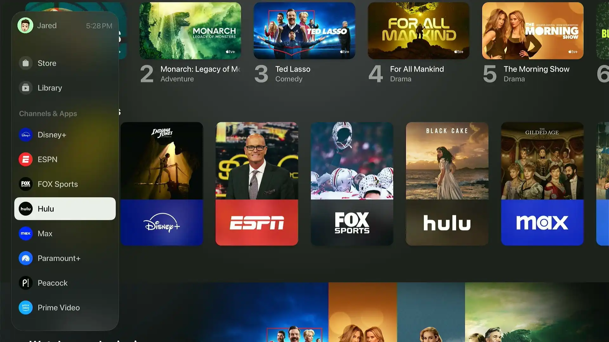
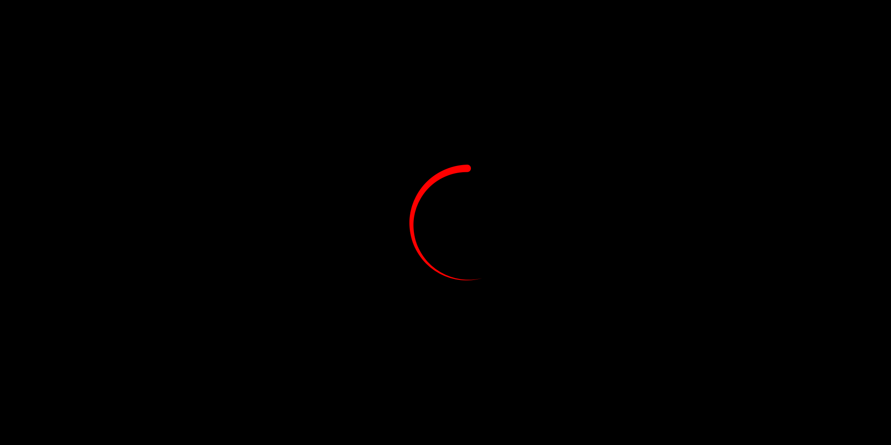
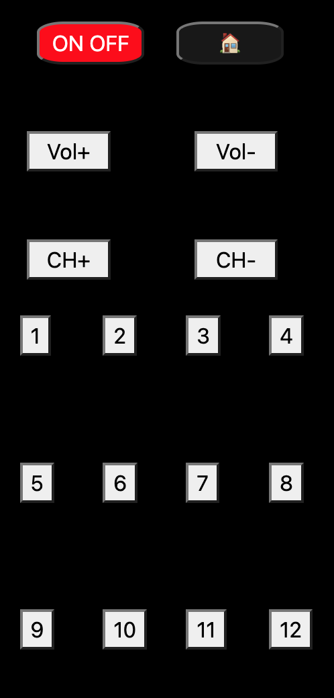

TELEVISIÓN INTERACTIVA ​
En el proyecto de la Televisión interactiva, he querido enfocarlo principalmente a lo funcional, usando diseños básicos tanto como para la pantalla como para el mando para así poder dedicar más tiempo a la interfaz gráfica de la pantalla en si.

📑 Descripción 📑

Este proyecto se divide en:

Pantalla: Se ha diseñado una pantalla de televisión con un menú principal inspirado en tvOS (el sistema operativo que utilizan las Apple TV), independiente de si nos encontramos en el "home" o en cualquier otro canal, siempre aparecerá en cual de los canales nos encontramos actualmente además de la hora actual en formato (hh:mm:ss)

Control remoto: Se implementa un control remoto usando HTML y CSS el cual se divide en 3 partes, parte superior (la cual incluye el botón HOME y el botón POWER), una parte media (la cual incluye los botones de volumen y de subir y bajar canal) y una parte inferior (la cual incluye el numero que lleva a los diferentes canales).

Selección de canal: se ha usado el DOM para así crear una lista de canales, los cuales se visualizan en el HTML a través de .channel (ubicado en el JS).

TECNOLOGÍAS USADAS:

Para el desarrollo del proyecto se utilizarán las siguientes tecnologías:

CSS : Se ha utilizado CSS para dar forma y tamaño tanto a la pantalla como al mando

JavaScript : Se ha utilizado para crear métodos de validación y dar funciones interactivas a la pantalla y al mando.

HTML: Para la estructura de la web.

Capturas de pantalla:

Home

Netflix

Mando

